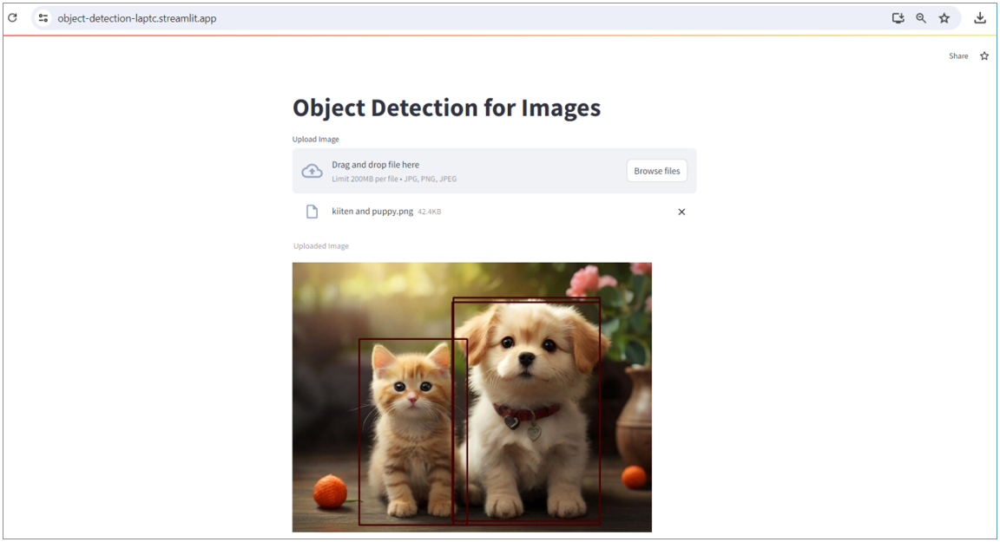

# Cat_Dog_Detection
A simple app in streamlit online for cats and dogs detection in an image

## How to run
1. Download folder M01_W04_Streamlit
2. Open file object_detection.py.py
3. Run file object_detection.py.py
4. You can access this app in streamlit online via this [URL](https://object-detection-laptc.streamlit.app/)

## Result  

